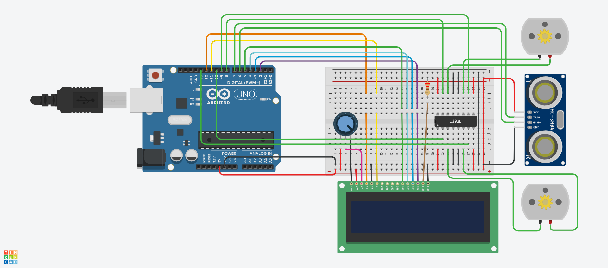

# Ultrasonic Sensor with Arduino LCD Project for Measuring Distance

## Hardware components:
  1. HC-SR04 sensor
  2. Arduino Uno Rev3
  3. L293D Motor Driver
  4. Breadboard
  5. Jumper wires
  6. USB cable type A/B
  7. 20×4 character I2C LCD 
  8. DC Motor

## Software:
  1. Arduino IDE
## Circuit Diagram:

